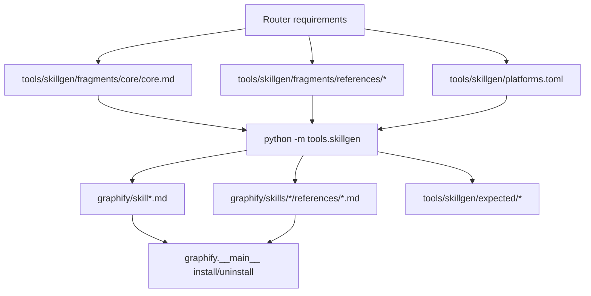

# Graphify Router Skill Design

**Spec**: `.specs/features/graphify-router-skill/spec.md`
**Status**: Draft

---

## Architecture Overview

Use the existing `tools/skillgen` pipeline as the only write path for skill artifacts. The lean router will live in `tools/skillgen/fragments/core/core.md`, heavy procedural flows will live in reference fragments, and `tools.skillgen` will render the committed `graphify/skill*.md`, `graphify/skills/<platform>/references/*.md`, and expected snapshots.



## Code Reuse Analysis

### Existing Components to Leverage

| Component | Location | How to Use |
| --- | --- | --- |
| Skill generator | `tools/skillgen/gen.py` | Reuse render/check/bless/audit paths; do not create a second generator. |
| Platform manifest | `tools/skillgen/platforms.toml` | Keep split/monolith platform declarations and reference destination mapping here. |
| Shared router template | `tools/skillgen/fragments/core/core.md` | Shrink to graph-first router plus concise command/reference map. |
| Query reference | `tools/skillgen/fragments/references/query/default.md` | Keep advanced query expansion, CLI/fallback traversal, `path`, and `explain` detail here. |
| Shared references | `tools/skillgen/fragments/references/shared/*.md` | Re-home build/update/export/add-watch/hooks/transcribe details here; add `build.md` if needed. |
| Progressive install plumbing | `graphify/__main__.py` | Reuse sidecar copy/version/uninstall behavior already covered by tests. |
| Drift tests | `tests/test_skillgen.py` | Extend marker, pointer, size, and coverage expectations. |
| Install/reference tests | `tests/test_install_references.py`, `tests/test_install_roundtrip.py`, `tests/test_install_upgrade.py`, `tests/test_agents_platform.py`, `tests/test_install.py` | Extend package/install assertions for any new reference and router shape. |

### Integration Points

| System | Integration Method |
| --- | --- |
| Skillgen CI | Commands in `.github/workflows/ci.yml`: `uv run --frozen python -m tools.skillgen --check`, `--audit-coverage`, `--schema-singleton`, `--monolith-roundtrip`, `--always-on-roundtrip`. |
| Pytest suite | Focused tests under `tests/test_skillgen.py` and install tests; full gate via `uv run --frozen pytest tests/ -q --tb=short`. |
| Generated package files | `graphify/skill*.md`, `graphify/skills/<platform>/references/*.md`, `tools/skillgen/expected/*`. |
| User install state | Tested with temp homes/projects; no real global `uv tool` reinstall in this feature. |

## Components

### Router Core Template

- **Purpose**: Provide the small always-loaded skill body: graph-first fast path, command route table, install/interpreter guard summary, and honesty rules.
- **Location**: `tools/skillgen/fragments/core/core.md`
- **Interfaces**:
  - Slot replacements: `@@FRONTMATTER@@`, `@@INSTALL@@`, `@@DISPATCH@@`, `@@QUERY_STUB@@`, `@@HOOKS_TARGET@@`, `@@EXTRA@@`
  - Markdown pointers to `references/<name>.md`
- **Dependencies**: `tools/skillgen/gen.py`, platform fragments, reference fragments.
- **Reuses**: Existing core template and pointer validation tests.

### Build Reference

- **Purpose**: Hold full explicit-build procedure if moved out of the router core.
- **Location**: Prefer `tools/skillgen/fragments/references/shared/build.md`, rendered to `graphify/skills/<platform>/references/build.md`.
- **Interfaces**:
  - Referenced by core router for `/graphify`, `/graphify <path>`, GitHub URLs, deep mode, video, large corpus, default build/export completion.
  - Added to `Platform.reference_sources()` through `_SHARED_REFERENCES` if introduced.
- **Dependencies**: Existing build pipeline prose currently in `core.md`.
- **Reuses**: Existing default pipeline commands and honesty rules, moved without semantic deletion.

### Reference Router Map

- **Purpose**: Keep command-to-reference routing explicit and testable.
- **Location**: `tools/skillgen/fragments/core/core.md`; source mapping in `tools/skillgen/gen.py`.
- **Interfaces**:
  - Command rows for `query`, `path`, `explain`, build, update, exports, add/watch, hooks.
  - Rendered pointer paths must match generated sidecars.
- **Dependencies**: `Platform.reference_sources()`, `test_reference_pointers_in_core_resolve_to_real_fragments`.
- **Reuses**: Existing pointer regex test pattern.

### Size Measurement Guard

- **Purpose**: Prove the router actually reduces context and prevents re-bloat.
- **Location**: `tests/test_skillgen.py` or a small helper in that test module.
- **Interfaces**:
  - Computes word counts for rendered split cores.
  - Compares to baseline committed output captured before feature edits or to a fixture/snapshot added in the task.
- **Dependencies**: `gen.render_all()`.
- **Reuses**: Existing render helpers in `tests/test_skillgen.py`.

### Install And Package Validation

- **Purpose**: Ensure sidecar references still ship and survive install lifecycle.
- **Location**: Existing tests in `tests/test_install_references.py`, `tests/test_install_roundtrip.py`, `tests/test_install_upgrade.py`, `tests/test_agents_platform.py`, `tests/test_install.py`.
- **Interfaces**:
  - Temp-home install/uninstall helpers.
  - Package file existence assertions.
- **Dependencies**: `graphify.__main__._copy_skill_file`, `_remove_skill_file`, `_check_skill_version`, platform config.
- **Reuses**: Existing fake bundle and temp install helpers.

## Data Models

No new runtime data model is introduced. The feature modifies build-time markdown fragments and generated artifacts. The relevant existing build-time model is:

```python
@dataclass(frozen=True)
class Platform:
    key: str
    bucket: str
    skill_dst: str
    refs_dst: str | None
    dispatch: str | None
    extraction: str
    shell: str
    hooks_variant: str
```

## Error Handling Strategy

| Error Scenario | Handling | User Impact |
| --- | --- | --- |
| Router points to missing reference | `test_reference_pointers_in_core_resolve_to_real_fragments` and `tools.skillgen --check` fail. | Prevents broken installable skill from shipping. |
| Generated artifact drift | `tools.skillgen --check` fails with exact stale/missing artifact message. | Maintainer regenerates or blesses snapshots before commit. |
| Build content accidentally duplicated in router | Marker tests in `tests/test_skillgen.py` fail. | Prevents context regression. |
| Sidecar missing at install time | Existing `_check_skill_version` warning and install reference tests catch missing references. | User gets repair signal rather than silent broken router. |
| Global reinstall needed for manual smoke | Document as explicit optional step, not automatic. | Avoids mutating user's global tool install during feature work. |

## Risks & Concerns

| Concern | Location (file:line) | Impact | Mitigation |
| --- | --- | --- | --- |
| Current core template still embeds a large default build pipeline. | `tools/skillgen/fragments/core/core.md:50` | Query-only use loads irrelevant build/extraction/export detail. | Re-home build detail into references and add negative marker tests. |
| Generator has many host-specific platform variants. | `tools/skillgen/platforms.toml:31` | A router edit can break only one platform's dispatch/hooks wording. | Render all split platforms and keep per-platform audit/roundtrip gates. |
| Generated and expected artifacts can drift. | `tools/skillgen/gen.py:400` | Manual edits or stale snapshots produce inconsistent package output. | Follow AD-001 and require `--check` plus expected snapshot review. |
| Tests currently assert the default pipeline is inline in the lean core. | `tests/test_skillgen.py:79` | Existing tests will intentionally fail once build detail moves to a reference. | Update tests to assert router pointers and reference completeness instead. |
| Real user global install state should not be mutated. | `03-graphify.md` validation guardrail | Reinstalling the global tool as a side effect could disturb the user's environment. | Use temp install tests; make any `uv tool` reinstall a separately approved manual smoke step. |

## Tech Decisions

| Decision | Choice | Rationale |
| --- | --- | --- |
| Source of truth | Edit `tools/skillgen/fragments/` and `tools/skillgen/platforms.toml`; regenerate artifacts. | Matches project generator and drift guards. Recorded as project-level `AD-001`. |
| Router scope | Keep query fast path inline; move heavy procedural content to references. | Optimizes the most common graph question path while preserving capability. |
| Validation emphasis | Prefer generator and install tests over manual global install. | Gives repeatable evidence without touching user environment. |
